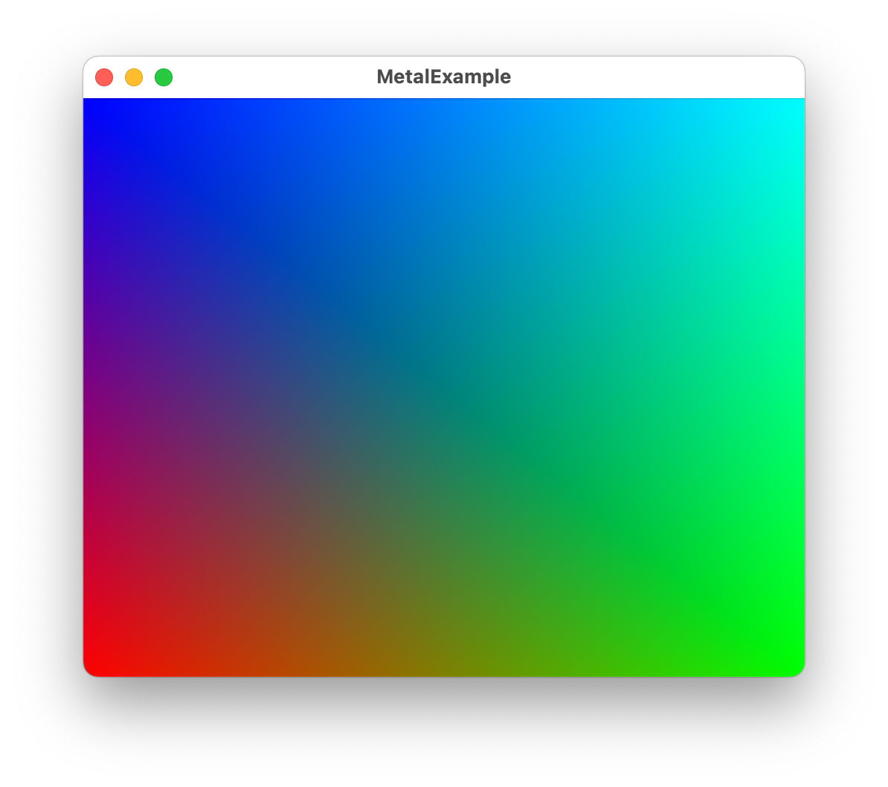

# MetalExample
4-Mar-2023 Flock of swifts meetup example.  Show cases:
* Using `MKTView` in a `UIViewRepresentable` and `NSViewUIViewRepresentable`.
* Creating a bridging header to share SIMD types with metal shaders and Swift
* Creating a simple vertex and fragment shader
* Setting up the rendering pipeline
* Rendering a triangle strip

